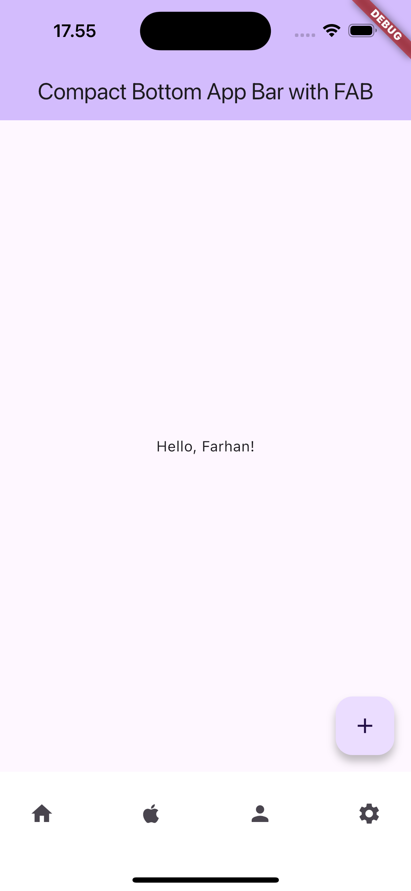

# Aplikasi Adaptive Design

Aplikasi ini berisi tampilan UI Adaptive yang compact beserta Floating Action Button

## Nama :
Muhamad Farhan - 4522210057

## Screenshots Halaman




## Penjelasan Tiap Halaman
- **Halaman Utama:** Halaman ini berisi Bottom App Bar yang compact dan juga menampilkan Floating Action Button

## Cara menjalankan aplikasi di Android Studio
```bash
flutter pub get
```

Jalankan aplikasi:

```bash
flutter run
```
